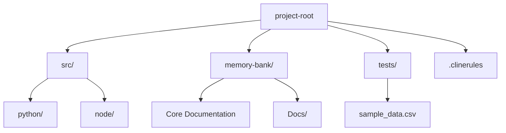

# Intelligent Expense Analyzer


## Overview
A dual-language financial analysis system combining Python data processing with Node.js web utilities. Features Model Context Protocol (MCP) integration for intelligent transaction categorization and secure API key management.

## Key Features
- Hybrid architecture (Python + Node.js)
- MCP-powered transaction categorization
- Automated spending pattern detection
- OpenAI-powered prediction models
- Secure .env configuration management
- CSV/JSON data processing pipelines

## Tech Stack

### Python Core
- Pydantic data validation
- pandas for data analysis
- OpenAI API integration
- Jupyter notebook support

### Node.js Utilities
- Fastify web server
- CSV-parser middleware
- REST API endpoints
- Automated report generation

## Installation

### Python Requirements
```bash
pip install -r requirements.txt
```

### Node.js Setup
```bash
npm install
```

## MCP Integration

1. Ensure transaction-categorizer MCP server is running:
```bash
cd /Users/bhaveshratanpal/Documents/Cline/MCP/transaction-categorizer
npm start
```

2. Configure categories in `categories.yaml`:
```yaml
categories:
  - name: "Utilities"
    patterns: ["Hydro", "Internet", "Water Bill"]
  - name: "Entertainment"
    patterns: ["Netflix", "Spotify", "Concert"]
```

3. Update MCP settings in `cline_mcp_settings.json`:
```json
{
  "mcpServers": {
    "transaction-categorizer": {
      "command": "node",
      "args": ["build/index.js"],
      "env": {
        "CATEGORIES_PATH": "categories.yaml"
      }
    }
  }
}
```

## Usage

### Python Processing
```bash
python src/python/csv_processor.py input.csv output.json
```

### Node.js Server
```bash
node src/node/csvHandler.js
```

## Security Practices

1. Never commit .env files
2. Rotate API keys quarterly
3. Use MCP servers for sensitive operations
4. Validate all input files with Pydantic models
5. Restrict filesystem access through config

## Project Structure



## Roadmap

- [x] MCP Integration
- [x] Dual-language architecture
- [ ] Real-time dashboard (Q3 2025)
- [ ] Bank API sync (Q4 2025)
- [ ] Mobile notifications (Q1 2026)
